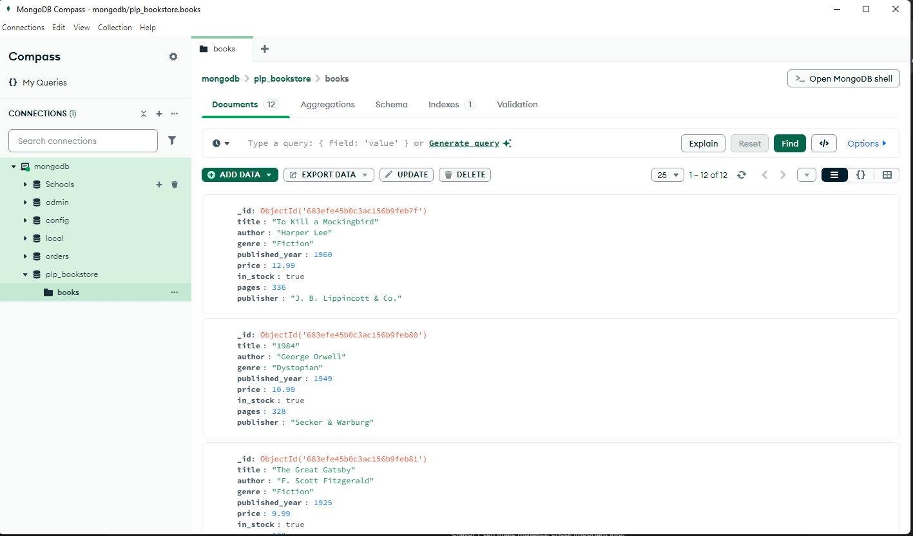

# PLP Bookstore MongoDB Project

## Requirements
- Node.js
- MongoDB (local or Atlas)
- MongoDB Shell (`mongosh`)

## 🚀 How to Run

1. Clone the repo
2. Run `npm install mongodb` (optional if using MongoDB driver)
3. Run the data script:
   ```bash
   node insert_books.js

4. Use mongosh or MongoDB Compass to run the queries in queries.js

Files

1. insert_books.js – populates the database

2. queries.js – contains all MongoDB queries for CRUD, advanced search, aggregation, indexing


### Screensho


### ✅ Submission Checklist

- [x] `insert_books.js`
- [x] `queries.js`
- [x] `README.md`
- [x] Screenshot from MongoDB Compass